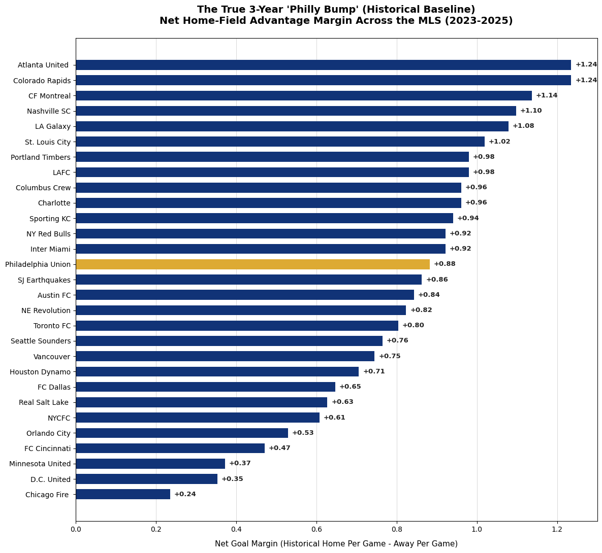
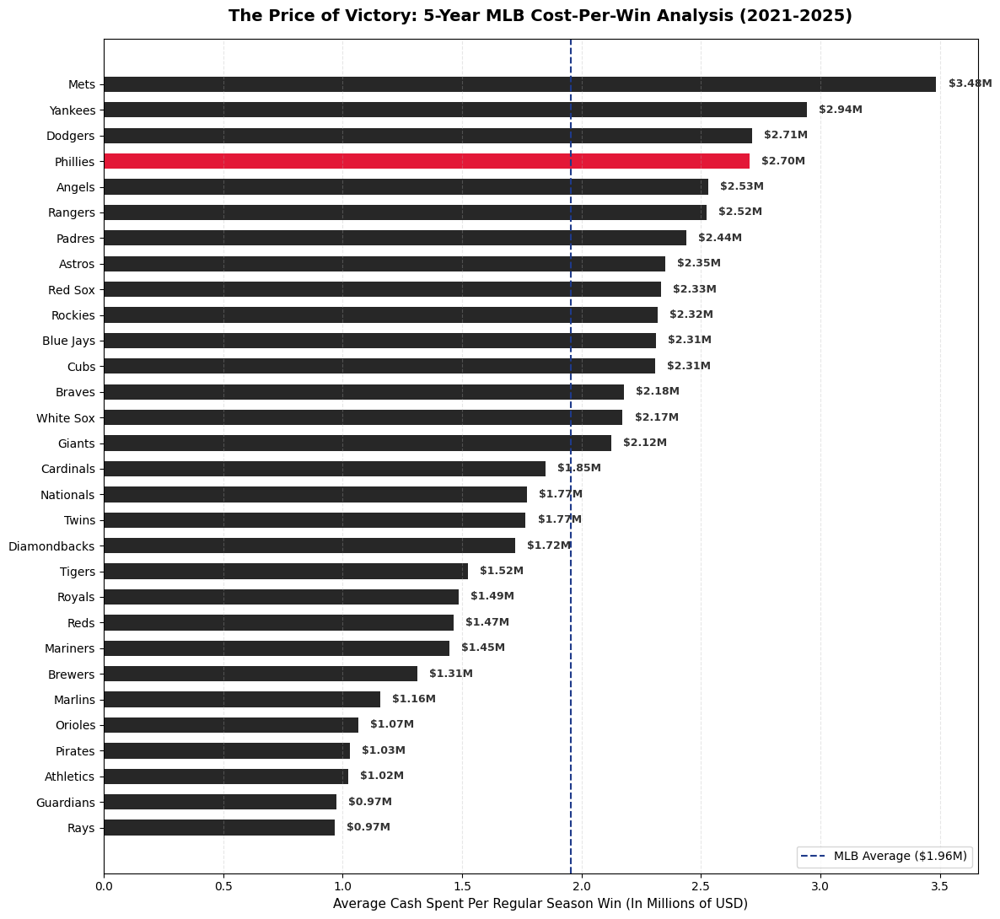

# Sports Analytics Portfolio
This repository contains Python data models and visualizations tracking advanced sports metrics.

## Project Overview
Language Used: Python 3
Libraries: Pandas, Matplotlib, Seaborn

## Visualizations

### Chart 1: The True 3-Year 'Philly Bump' (Historical Baseline)
Measuring the structural home-field advantage metrics across Major League Soccer (MLS) data.

View the full data model code in the [MLS Home Field Advantage Notebook](Home_Field_Advantage_Graph_2025_MLS.ipynb).

.

### Chart 2: The Price of Victory
Measuring the amount of cash each MLB team pays for each victory from 2021 to 2025.

View the full data model code in the [MLB Cost Per Win Notebook](MLB_Cost_per_Win.ipynb).

.

### Chart 3: The Sustained Contention Scale
Measuring the success of each MLB team paired with their consensus average farm ranking from 2021 to 2025.

View the full data model code in the [MLB Farm Rankings vs Wins Notebook](Farm_System_Rankings.ipynb).

.
